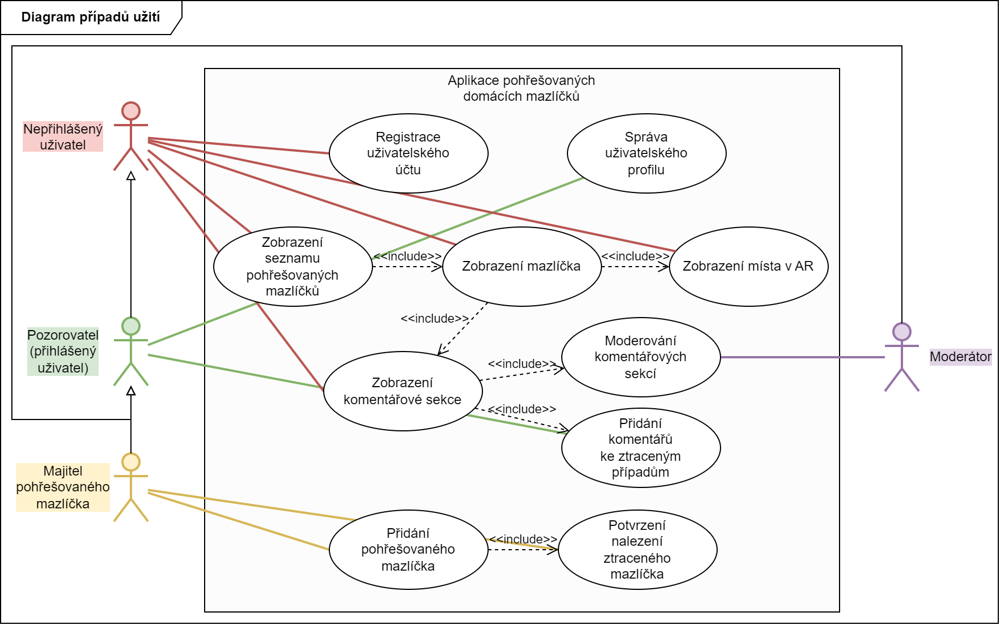

# Semestrální práce
Tento repozitář obsahuje řešení semestrální práce z předmětu `4IT575 Softwarové architektury`.

## Řešitelé
- Brázda Jan
- Kozlova Olesia
- Nerad Vojtěch

## Odkazy
- [Microservices](https://github.com/vojtechnerad/4IT575-seminarni-prace/blob/main/microservies/README.md)
- [SOA](https://github.com/vojtechnerad/4IT575-seminarni-prace/blob/main/soa/README.md)

## Zadání
Původní znění zadání semestrální práce.

### Popis aplikace
Služba věnující se pohřešovaným domácím mazlíčkům. Služba nabízí popis pohřešovaných zvířat, jejich nálezů a údaje o místech, kde se dané zvířátko pohybovalo. Služba také využívá rozšířenou realitu k zobrazení místa, kde byl mazlíček spatřen naposledy.

Uživatelé: desítky majitelů pohřešovaných domácích mazlíčků, stovky "pozorovatelů" (zpočátku), v závislosti na úspěchu zavádění širší okruh uživatelů.

### Požadavky
- Uživatelé, kteří mají zájem o nalezení domácích mazlíčků, se zaregistrují na webu.
- Kdokoli si může prohlédnout seznam pohřešovaných domácích mazlíčků v blízkosti místa kde se pohybuje.
- Nálezci domácích mazlíčků mohou zveřejňovat zprávy "nalezeno" (s povinným důkazem v podobě fotografie) a po potvrzení od majitelů domácích mazlíčků sbírat odměny.
- Uživatelé mohou komentovat záznamy o pohřešovaných domácích mazlíčcích a nabízet údaje (spatřeno, zkontrolovaná oblast bez výsledku atd.)
- Dostupnost pro mobilní zařízení.

### Další souvislosti
- Jedna z řady služeb rozšířené reality, které spouští mateřská společnost.
- Místní škálovatelnost (na město), ale případně i rozšíření do dalších měst.
- Společnost chce vytvořit větší sociální komunitu kolem domácích zvířat.
- Potenciální příjmy z reklamy od partnerů, jako jsou obchody s domácími zvířaty, mají potenciál vydělat statisíce.

## TODO část

### Diagram případů užití

Na základě předem daného zadání jsme definovali role uživatelů a případy užití pro danou aplikaci: 

## Uživatelské role

#### Neregistrovaný uživatel 

* Uživatel si může zobrazit a prohlédnout seznam pohřešovaných mazlíčků (dostupné pouze omezené zobrazení).
* Takový uživatel může vyhledávat mazlíčky v okolí (ale pouze do vzdálenosti 5 km) na mapě nebo v AR, ale bez možnosti přidávat komentáře, stavy apod.

#### Registrovaný uživatel 

* Po registraci a přihlášení takový uživatel má přístup k vlastním záznamům (komentáře, odměny apod.).
* Může zobrazit seznam pohřešovaných mazlíčků v okolí – na mapě nebo v AR bez jakýchkoliv omezení
* Může přidávat komentáře k záznamům o pohřešovaných mazlíčcích.
* Rovněž může přidat “Nalezeno” (pokud se mu podaří najít ztracené zvíře)a vkládat fotky.
* Pokud uživatel dostane potvrzení od majitele mazlíčka, že je to opravdu on, tak takový uživatel může získat odměnu.
  
#### Majitel pohřešovaného mazlíčka (pod-typ registrovaného uživatele) 

*	Může přidat záznam o pohřešovaném zvířeti (fotografie, popis, odměna, poslední známá poloha).
*	Po obdržení upozornění “Nalezeno!” může potvrdit, že se jedná o jeho zvíře.
*	Může přidat odměnu tomu uživateli, který jeho mazlíčka našel (přes správu odměn).
  
#### Moderátor 
*	Moderátor se zabývá kontrolu obsahu: upravuje a maže nevhodné komentáře.
*	Dohlíží na správnost zveřejněných informací (např. falešné záznamy).

