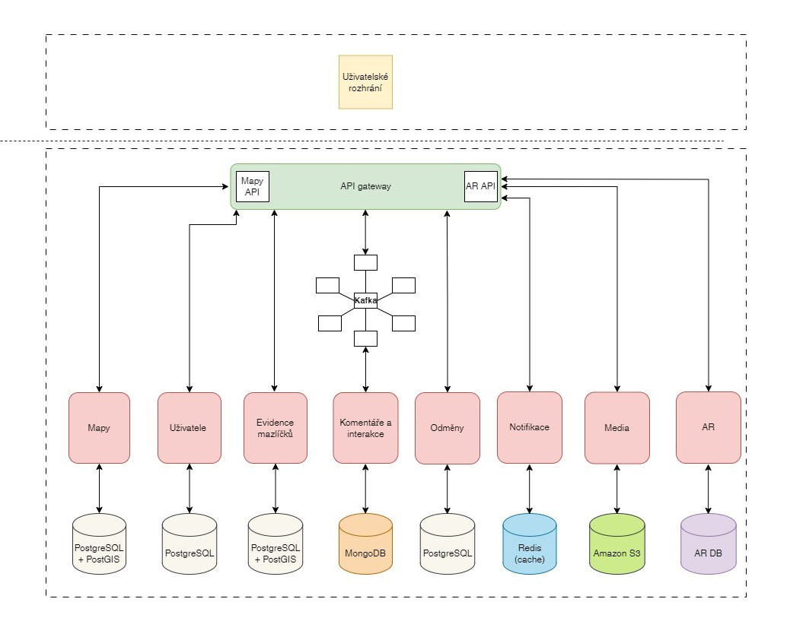
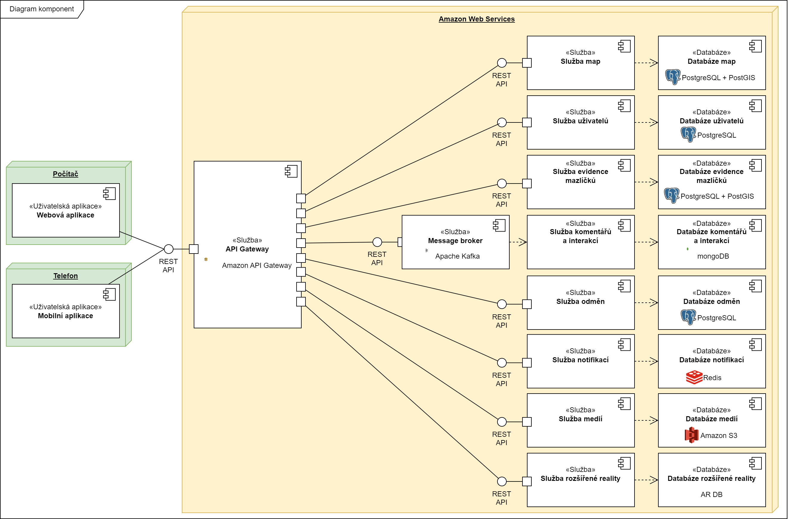

[Seminární práce](../README.md) / [Architektura mikroslužeb](README.md)

# Architektura mikroslužeb

## Dokumenty
1. [Rozhodnutí o celkové architektuře systému](acr/1-celkova-architektura/README.md)
2. [Rozhodnutí o podobě rozšířené reality v systému](acr/2-rozsirena-realita/README.md)
3. [Rozhodnutí o autorizaci a autentizaci uživatelů](acr/3-autentizace-autorizace/README.md)
4. [Rozhodnutí o architektuře klientské aplikace](acr/4-architektura-klient/README.md)
5. [Rozhodnutí o databázi aplikace](acr/5-databaze/README.md)
6. [Rozhodnutí o infrastruktuře](acr/6-infrastruktura/README.md)
7. [Rozhodnutí o vlastnostech systému](acr/7-decisions/README.md)

## Diagram

## Diagram komponent

## Přehled výhod a nevýhod využití architektury mikroslužeb

### Výhody použití architektury mikroslužeb pro tuto aplikaci
- **Modularita**: Systém je rozdělen na jednotlivé mikroservisy, z nichž každá řeší konkrétní část funkcionality, jako je správa uživatelů, příspěvků nebo geolokace. Díky tomu lze snadno přidávat nové funkce nebo upravovat stávající části systému bez rizika ovlivnění ostatních.
- **Škálovatelnost**: Mikroservisy umožňují nezávislé škálování. Například při vysoké zátěži mapové služby ji lze škálovat samostatně, což šetří zdroje a zajišťuje stabilitu celého systému i při rostoucím počtu uživatelů.
- **Flexibilní integrace**: Standardizovaná komunikace prostřednictvím REST API umožňuje jednoduché propojení s externími systémy, jako jsou mapové služby, platformy rozšířené reality, reklamní platformy nebo analytické nástroje. To zvyšuje možnosti spolupráce s partnery i potenciální příjmy.
- **Vysoká dostupnost**: Selhání jedné mikroservisy neohrozí funkčnost ostatních částí systému. Například problém s notifikační službou nezastaví příjem nových hlášení o pohřešovaných zvířatech.
- **Technologická nezávislost**: Každá mikroservisa může být vyvíjena pomocí různých technologií a nástrojů, což umožňuje vývojářům zvolit nejvhodnější řešení pro danou část aplikace. Například jedna služba může používat databázi PostgreSQL, zatímco jiná může být postavena na Node.js.
- **Jednodušší údržba a testování**: Díky oddělení jednotlivých částí aplikace je snazší identifikovat a opravit chyby nebo testovat konkrétní funkcionalitu. Tato izolace minimalizuje riziko šíření problémů do ostatních částí systému.
- **Rychlejší vývoj**: Menší týmy mohou pracovat nezávisle na vývoji konkrétních mikroservis. Díky tomu je možné paralelizovat práci, což zrychluje celý vývojový cyklus a nasazování nových funkcí.
- **Připravenost na růst**: Mikroservisní architektura je ideální pro budoucí rozšiřování aplikace. Ať už jde o podporu dalších regionů nebo přidávání nových funkcí, systém na to bude dobře připraven.
- **Podpora CI/CD**: Samostatné nasazení jednotlivých mikroservis umožňuje využití CI/CD procesů, což usnadňuje aktualizace, rychlé opravy chyb nebo nasazování nových verzí.

### Nevýhody použití architektury mikroslužeb pro tuto aplikaci
- **Vyšší složitost návrhu**: Rozdělení aplikace na mikroservisy vyžaduje pečlivý návrh komunikace mezi nimi. Je potřeba zohlednit nejen datové toky, ale také způsob správy chyb a synchronizace mezi jednotlivými částmi.
- **Latence při komunikaci**: Komunikace mezi mikroservisami přes API přidává určitou režii a latenci. To může být problém zejména u funkcí, kde je rychlost klíčová, například při zobrazování mapových dat v reálném čase.
- **Zvýšené nároky na infrastrukturu**: Každá mikroservisa běží nezávisle, což znamená vyšší spotřebu výpočetních zdrojů, náročnější správu serverů a větší požadavky na šířku pásma.
- **Bezpečnostní rizika**: Každá mikroservisa představuje nový vstupní bod do systému, který je potřeba zabezpečit. To zahrnuje správnou autorizaci, šifrování dat a ochranu proti útokům.
- **Konzistence dat**: Zajištění konzistence dat napříč distribuovaným systémem může být složité. Tento problém je zvlášť výrazný u transakcí, kde je třeba balancovat mezi dostupností a konzistencí.
- **Monitoring a diagnostika**: Sledování stavu a výkonu jednotlivých mikroservis, jejich logování a řešení problémů vyžaduje pokročilé nástroje a zkušené týmy. Diagnostika problémů v takto komplexním systému může být náročná.
- **Závislost na kvalitě návrhu**: Pokud jsou mikroservisy navrženy příliš malé nebo naopak příliš rozsáhlé, mohou ztratit výhody této architektury. Špatný návrh může vést k problémům s výkonem a rozšiřitelností systému.
- **Vyšší počáteční náklady**: Nastavení infrastruktury pro mikroservisy, včetně orchestrátorů jako Kubernetes, nástrojů pro monitoring a API gateway, představuje větší investici z hlediska času i financí.
- **Fragmentace týmu**: Práce na oddělených mikroservisách může vést k tomu, že členové týmů ztratí přehled o celkové struktuře aplikace, což může způsobit problémy při integraci a vývoji nových funkcí.
- **Komplexnější správa verzí**: Neustálé aktualizace a změny v jednotlivých mikroservisách mohou vést k problémům s verzemi, což vyžaduje důsledné plánování a řízení závislostí.
