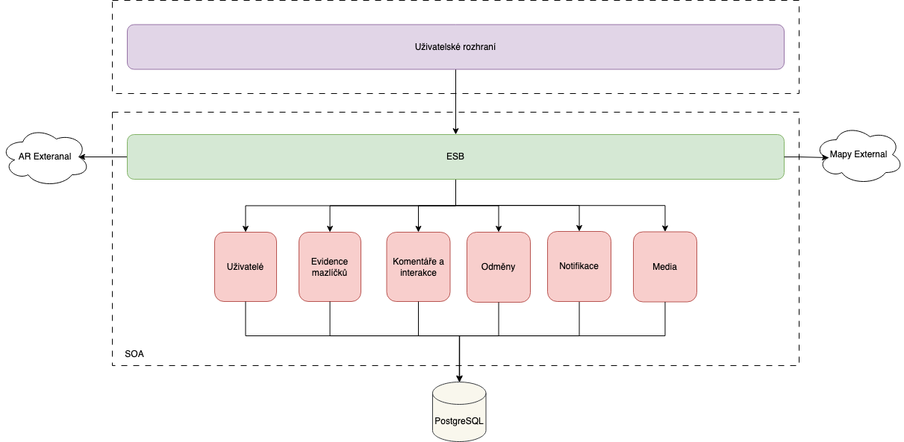

[Seminární práce](../README.md) / [Architektura orientovaná na služby](README.md)

# Architektura orientovaná na služby

## Dokumenty
1. [Rozhodnutí o celkové architektuře systému](acr/1-celkova-architektura/README.md)
2. [Rozhodnutí o podobě rozšířené reality v systému](acr/2-rozsirena-realita/README.md)
3. [Rozhodnutí o autorizaci a autentizaci uživatelů](acr/3-autentizace-autorizace/README.md)
4. [Rozhodnutí o architektuře klientské aplikace](acr/4-architektura-klient/README.md)
5. [Rozhodnutí o databázi aplikace](acr/5-databaze/README.md)
6. [Rozhodnutí o infrastruktuře](acr/6-infrastruktura/README.md)
7. [Rozhodnutí o vlastnostech systému](acr/7-decisions/README.md)

## Diagram

## Přehled výhod a nevýhod využití architektury orientované na služby

### Výhody použití SOA pro tuto aplikaci
1.	**Modularita** - Systém je rozdělen na samostatné služby (např. uživatelé, příspěvky, geolokace), což umožňuje snadné přidávání nových funkcí nebo úpravy jednotlivých částí bez ovlivnění ostatních.
2.	**Škálovatelnost** - Jednotlivé služby lze nezávisle škálovat, což umožňuje efektivní využití zdrojů.
3.	**Flexibilní integrace** - Díky standardizované komunikaci pomocí REST API je snadné integrovat externí systémy, jako jsou mapové služby, rozšířená realita nebo reklamní platformy.
4.	**Vysoká dostupnost** - Výpadek jedné služby neovlivní ostatní části systému.
5.	**Technologická nezávislost** - Každá služba může být implementována v jiném programovacím jazyce nebo na jiné platformě, což umožňuje použití nejvhodnějších nástrojů pro danou funkci.
6.	**Jednodušší údržba a testování** - Oddělení funkcí do samostatných služeb usnadňuje lokalizaci problémů, jejich opravu a testování jednotlivých částí systému.
7.	**Příprava na budoucí růst** - SOA umožňuje snadnou geografickou expanzi.

### Nevýhody použití SOA pro tuto aplikaci
1.	**Vyšší složitost návrhu a vývoje** - Implementace SOA vyžaduje pečlivý návrh rozhraní mezi službami a koordinaci jejich komunikace.
2.	**Latence při komunikaci** - Komunikace mezi službami pomocí REST API přidává latenci, což může být problém u funkcí citlivých na rychlost (např. zobrazení mapových dat v reálném čase).
3.	**Zvýšené nároky na infrastrukturu** - Každá služba běží nezávisle, což zvyšuje požadavky na servery, síť a monitoring.
4.	**Bezpečnost** - Větší počet služeb znamená více vstupních bodů, které je třeba zabezpečit (např. autentizace, šifrování dat).
5.	**Problémy s konzistencí dat** - V distribuovaném prostředí je obtížnější zajistit konzistenci dat napříč službami, což může být problém při transakcích.
6.	**Závislost na kvalitě návrh** - Špatně navržené služby (např. příliš malé nebo naopak příliš velké) mohou způsobit problémy s výkonností a rozšiřitelností systému.
7.	**Náročnější monitoring a ladění** - Sledování stavu více služeb, jejich logů a metrik zvyšuje složitost diagnostiky a řešení problémů.
8.	**Vyšší vstupní náklady** - Pořízení a nastavení infrastruktury pro SOA (např. orchestrátor služeb, API gateway, monitoring) vyžaduje větší počáteční investici.
